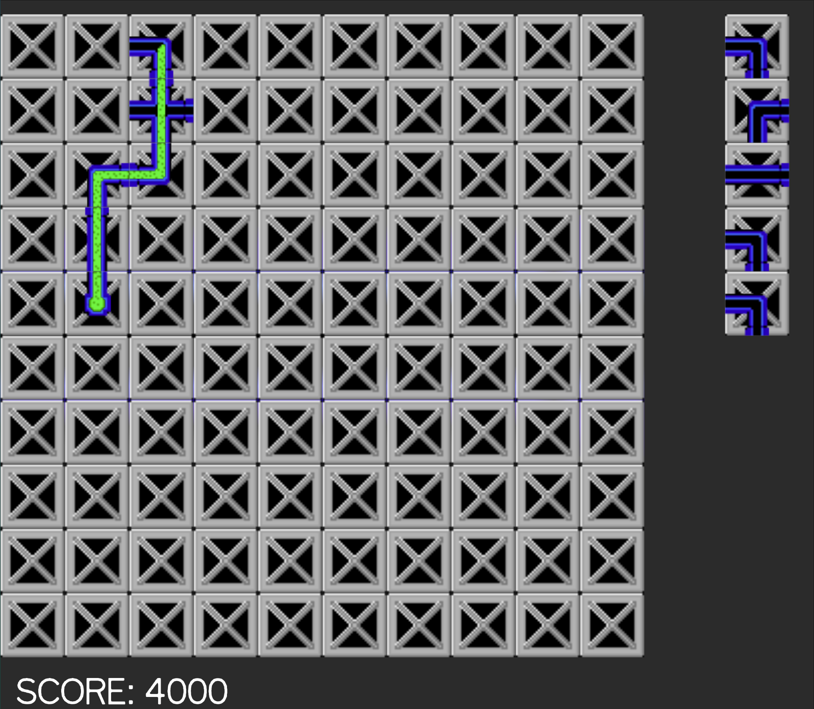

# Plumbeteer Design Document

## Game Summary

Action puzzle game where you try to lay down pipes before the liquid overflows them.

## Inspiration

### [Pipemania](https://en.wikipedia.org/wiki/Pipe_Mania)

Pipemania was a 1989 game that I am trying to create an omage to. I loved this game a lot and would like to create a worthy remake.

You can find the original gameplay on [Youtube](https://www.youtube.com/watch?v=wUCKC_-8rnM).

## Player Experience

In a single screen play grid there is a start and (optionally) an end of the pipeline. When start timet runs out the liquid starts flowing from the start. When the liquid spills, the game is over. When the liquid reaches the end the current level is finished.

The player has a fifo stack of pipe tiles that he can place on the play grid to provide a safe path for the liquid. Player can replace tiles that has not yet been touched by the liquid.

It's a race against the clock, since every action takes little bit of time and the liquid is coming.

## Platform

- main platform is the web browser
- it should be possible to also release desktop (jvm) and Android releases but it is just nice to have

## Development Software

- IntelliJ Idea Ultimate for the programming
- Kotlin + [KorGE](https://korge.org) as tech stack
- LibreSprite for graphics

## Genre

Singleplayer, puzzle, causual, action

## Target Audience

Easy to understand game mechanics and fast game loop this should be a great game for *causual game players*.

# Concept

## Tiles

### Player Placeable Tiles

- straight pipe (horizontal and vertical)
- corner pipe (all orientations)
- crossing pipe (combined horizontal and vertical straight pipe)

### Generated Static Tiles

#### Mvp

- start pipe 

#### Optional

- end pipe -- if present the liquid must be routed here
- blocked tile -- player can not place a tile here
- reservoir -- bonus score and gives player a time to use
- tunnels

## Level Types

### Mvp

- basic -- you have a minimum pipe length to achieve before the spill happens

### Optional

- bound -- there is an end tile somewhere where your liquid needs to go
- bonus -- instead of placing blocks you swipe them around

# Design

I will aim for a simple pixel art resembling similar style to original game.

# Audio

I will probably won't be able to audio in time, but in the future I will probably add some midi music and retro sound effects.

